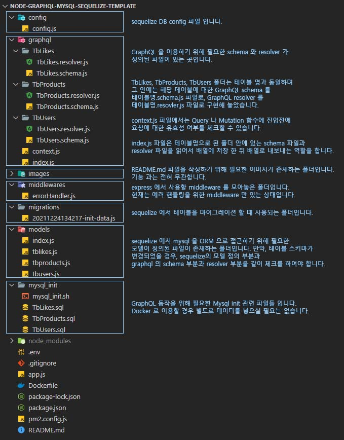

# node-graphql-mysql-sequelize-template
<!-- Some description here-->
Node.js의 Express프레임워크를 기반으로 Mysql을 Sequelize와 GraphQL으로 연동, 구현한 프로젝트 입니다.
#

## 구조도

#

## 폴더 구조

#

## 실행 방법

본 프로젝트는 간편하게 Docker image 를 내려받아 Docker 로 구동 가능합니다.

1. docker run -i -t -d --privileged -p 3306:3306 -p 8040:8040 --name node-graphql-mysql-sequelize-template wisdomstar94/node-graphql-mysql-sequelize-template:latest
2. Mysql 구동 및 node 프로젝트 구동시 약간의 시간이 걸릴 수 있으니 10초 ~ 30초 정도 기다려주세요.
3. 이제 http://localhost:8040/api 으로 graphql 을 체험해 보실 수 있습니다. (어떤 규격으로 요청을 보내야 하는지는 하단에 표기되어 있습니다.)
4. DB 접속 정보 
- ip : localhost
- port : 3306
- id : test
- pw : 112233abc

#

## GraphQL 요청 및 응답 샘플 (POSTMAN 기준)

#

## 프로젝트 정보
- 주요 키워드
  - Node.js
  - Express
  - GraphQL
  - Sequelize
  - Mysql  
- 사용 언어
  - Javascript (Node.js)
- API 엔드포인트
  - /api
- 사용 라이브러리
  - apollo-server-express
  - cookie-parser
  - debug
  - dotenv
  - express
  - graphql
  - http-errors
  - mysql2
  - sequelize

#

## 제작자 정보

- Email: wisdomstar94@gmail.com

